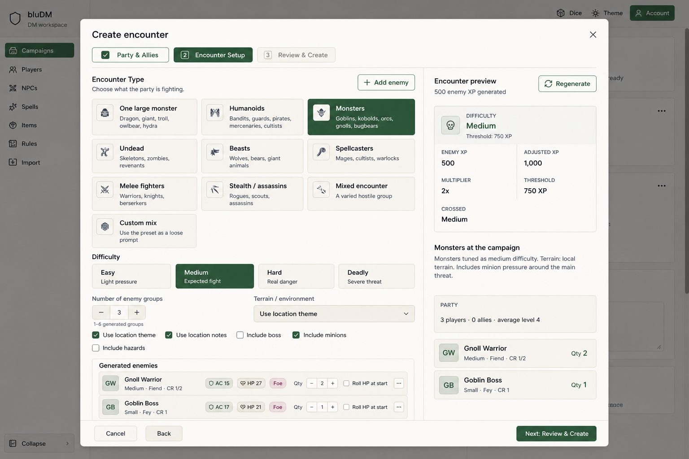
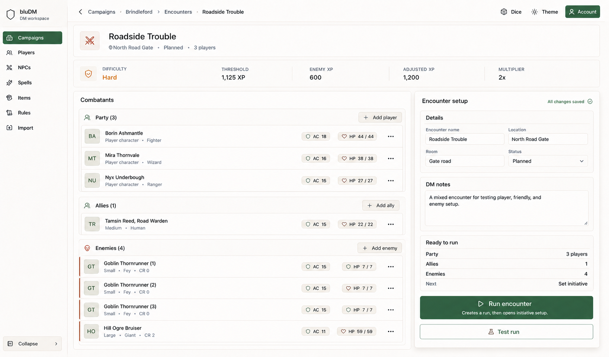
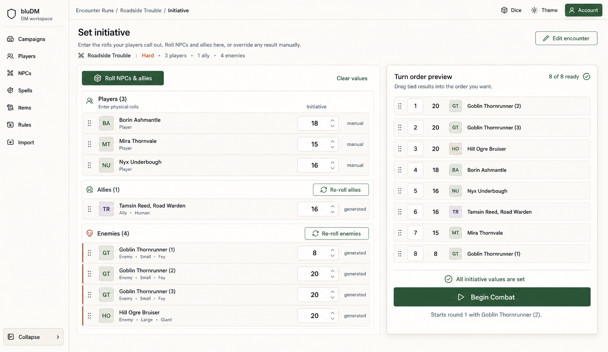
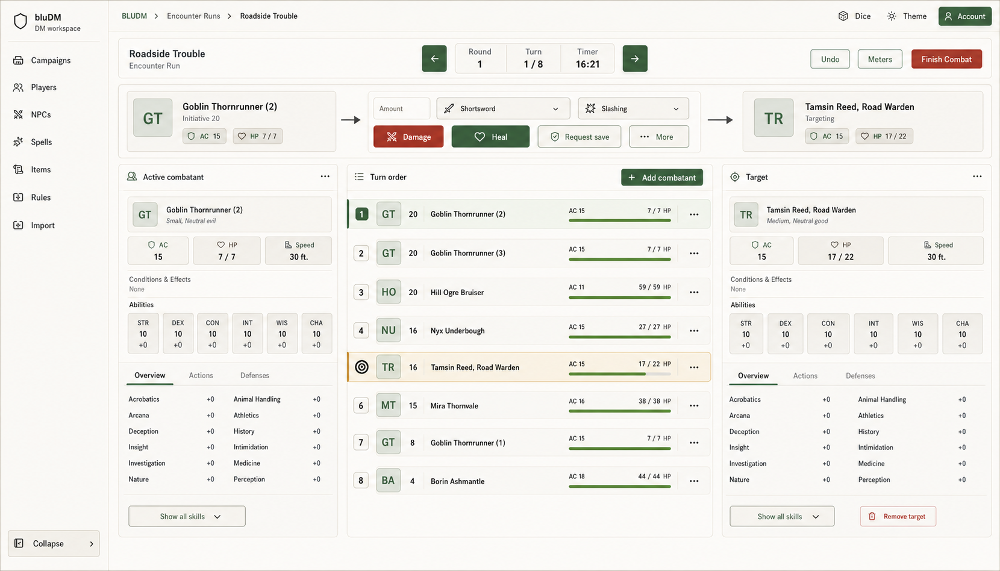
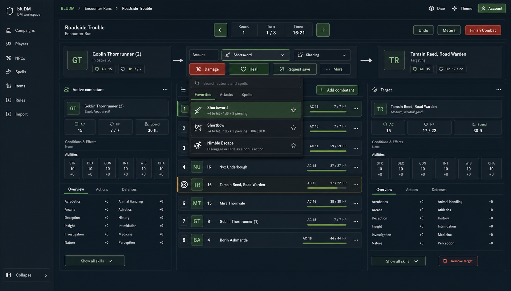

# DM Encounter Flow UX Refresh

These mockups cover the DM-only flow from creating an encounter through running combat. The
encounter builder is the visual anchor: configuration stays on the left, verification stays on the
right, and the primary action appears beside the information needed to make that decision.

Players continue to roll physical dice. The DM enters player initiative, uses bluDM to roll NPCs
and allies, tracks AC and HP, resolves selected NPC actions, and applies manual damage or healing.

## Mockups

### Refined encounter builder



The builder already has the strongest information architecture, so this concept makes only modest
changes: stronger selected-state contrast, denser generated-enemy rows, a steadier preview column,
and an always-visible footer.

### Encounter editor



The editor adopts the builder's configure-and-review structure. The roster is the main workspace,
while details, DM notes, readiness, and the single set of run actions remain in a sticky review
column.

### Physical-dice initiative setup



Players have manual initiative fields because they roll at the table. NPCs and allies can be
rolled together or by side, and every generated result remains editable. The ordered preview is
where the DM resolves ties and confirms that every value is ready before beginning combat.

### Warm light workspace



This should be treated as the baseline direction. It keeps the existing warm cream and forest
theme while reducing border noise, tightening initiative rows, and moving the current turn into a
single actor → action → target command surface.

### Dark workspace with action picker



This uses the same information architecture in bluDM's dark tokens. The open action picker shows
how search, categories, favorites, and concise action summaries can remain contextual to the turn
without replacing the combat workspace.

## Product decisions

- This is a DM workspace; there is no player portal or player-facing roll control.
- Player initiative is entered manually from physical rolls.
- NPC and ally initiative can be generated in bulk, by side, or manually overridden.
- Initiative `0` and negative initiative are valid values; an empty input is not converted to `0`.
- Combat cannot begin until every combatant has an initiative value.
- Ties are resolved by the explicit order in the preview.
- Clearing initiative must reset `initiativeSet`; it must not simulate clearing by storing `0`.
- Encounter editing has one set of run actions beside the readiness summary.
- The combat tracker prioritizes manual HP adjustments and selected NPC actions.
- Existing save, spell, log, undo, death-save, and test-run behavior remains available.

## What the current tracker already does well

- The active sheet, initiative, and target sheet are visible at the same time.
- High-value combat values such as AC, HP, initiative, and speed are easy to find.
- The warm light theme is readable and recognizably bluDM.
- Resolution controls support damage, healing, saves, manual results, and modelled actions.
- Light and dark semantic tokens already exist, so a visual refresh does not require a
  route-specific palette.

## UX problems to address

### The primary task is not visually dominant

The user is usually trying to answer three questions:

1. Who is acting?
2. What are they doing?
3. Who is affected?

The current screen contains all three answers, but they are separated across a large status area,
the action strip, the initiative list, and the target sheet. The proposed command surface keeps
that relationship visible in one horizontal flow.

### Every region has nearly the same visual weight

Repeated bordered panels, full sheets, stat tables, initiative cards, and bright HP bars compete
for attention. The mockups reserve the strongest emphasis for the current-turn command surface and
use flatter, quieter treatment for reference data.

### Full sheets expose low-frequency information too early

Skills are useful during combat, but most turns need identity, vitals, defenses, conditions, and
actions first. The mockups introduce `Overview`, `Actions`, and `Defenses` views and place the full
skill list behind `Show all skills`.

### Initiative rows over-encode state

Enemy text, colored borders, tinted backgrounds, HP bars, initiative circles, AC tiles, and state
badges all compete within each row. The proposed rows use:

- a narrow acting marker;
- an explicit target icon;
- a restrained row tint;
- compact AC and HP text;
- a calm HP bar;
- an overflow action.

Active and targeted states remain understandable without relying on color alone.

### The action menu is less capable than an existing implementation

The rendered `CombatControls` path uses the older `ActionMenu`. The repository already contains
`CombatActionPicker`, including search, categories, favorites, recent actions, and keyboard
navigation. Reusing that behavior would move the production UI toward the dark interaction
mockup without inventing a parallel control.

## Recommended information hierarchy

### 1. Encounter toolbar

Keep round, turn, timer, previous/next, undo, meters, and finish controls compact. Add the encounter
name to the otherwise empty leading region and keep the whole toolbar sticky within the combat
workspace.

### 2. Turn command surface

Present the active actor, action resolution controls, and selected target as one relationship:

```text
Actor summary  →  Amount / Action / Damage type / Resolve  →  Target summary
```

Keep damage, healing, and save controls explicit. Place lower-frequency controls under `More`.

### 3. Three-region workspace

- **Active combatant:** concise reference for the actor.
- **Turn order:** the widest and most frequently manipulated region.
- **Target:** concise reference for the selected target.

The center column should remain the visual spine. The two sheets should expose deep information
progressively rather than showing every skill by default.

### 4. Combat log

Keep the current log after the workspace or offer it as a collapsible lower drawer. It should not
compete with the current turn unless the user opens it.

## Component-level implementation map

| Current area                          | Suggested change                                                                                                  |
| ------------------------------------- | ----------------------------------------------------------------------------------------------------------------- |
| `CombatStatusBar`                     | Use the empty leading region for the encounter name, tighten spacing, and make the bar sticky.                    |
| `ActiveTurnHeader` + `CombatControls` | Compose them into the actor → action → target surface while preserving their existing resolution callbacks.       |
| `CombatActionPicker`                  | Reuse its search, favorites, recent items, categories, and keyboard behavior in the rendered combat path.         |
| `CombatBoard`                         | Keep three columns, increase the center column's relative weight, and preserve `min-w-0` and contained scrolling. |
| `TargetRow`                           | Reduce vertical height and colored framing; use explicit acting and target markers plus compact vitals.           |
| `CombatSheet`                         | Add Overview / Actions / Defenses views and collapse the full skill list by default.                              |
| `CombatLog`                           | Keep below the board or make it a deliberate drawer; do not add a permanent competing rail.                       |

## Visual rules

- Use existing semantic theme tokens for light, dark, accent, companion, and status colors.
- Do not use named enemy/player colors as a substitute for selection or targeting.
- Keep destructive red for destructive actions and danger states, not every enemy row.
- Use 6–10 px radii, 1 px borders, a consistent 8 px spacing rhythm, and restrained shadows.
- Keep controls at least 40 px high and preserve visible focus states.
- Use tabular numerals for initiative, HP, AC, round, turn, and timer values.
- Pair every state color with text, an icon, a border, or a positional marker.
- Avoid decorative gradients, glows, fantasy frames, oversized panels, and badge-heavy rows.

## Suggested implementation sequence

1. Apply the builder's small contrast, row-density, preview, and footer refinements.
2. Restructure the encounter editor around the roster and one sticky setup/review column.
3. Rebuild initiative entry around manual player values and generated-but-editable NPC values.
4. Add client and server guards against beginning combat with unresolved initiative.
5. Switch the rendered combat action control to the existing `CombatActionPicker`.
6. Compact `TargetRow` while preserving its current target-selection behavior.
7. Build the actor → action → target command surface from the current header and control
   callbacks.
8. Add progressive disclosure to `CombatSheet`.
9. Tighten `CombatStatusBar` and make the combat command area sticky.
10. Verify existing light, dark, and accent combinations.

## Acceptance checks

- The encounter builder retains its current three-step behavior and data preservation.
- The encounter editor contains only one set of Run and Test actions.
- No `Roll Players` control appears in initiative setup.
- Player initiative accepts physical-roll values without unstable per-keystroke saves.
- Generated NPC and ally values remain editable.
- Empty initiative is distinct from initiative `0`.
- Begin Combat is disabled client-side and rejected server-side while any value is unresolved.
- Reordering tied initiatives persists into round one.
- The acting combatant, chosen action, and target can be identified in under two seconds.
- Active and target states remain clear in grayscale.
- A normal turn can be resolved without scrolling the page.
- Opening the action picker does not reflow the board.
- The turn-order column scrolls independently when the encounter is long.
- Light and dark modes preserve readable text and interactive foreground contrast.
- The layout does not add horizontal overflow at desktop or mobile breakpoints.
- Full sheets remain available even though their low-frequency details are initially collapsed.

The ready-to-paste implementation brief is in
[`implementation-prompt.md`](./implementation-prompt.md).
